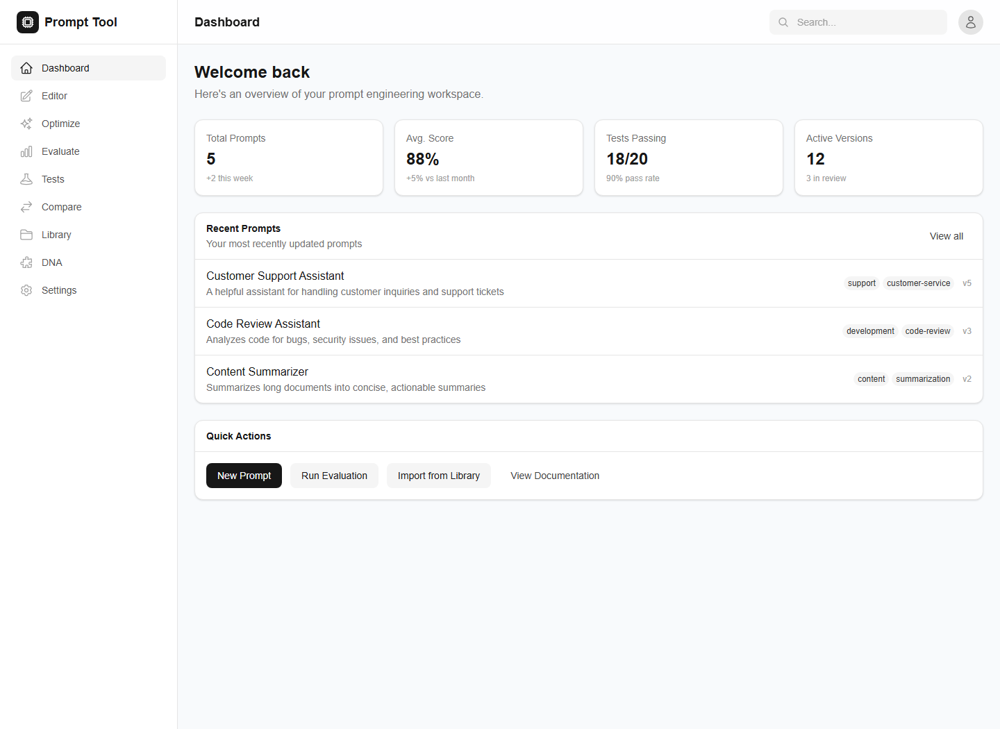

# AI Prompt Workspace

AI Prompt Workspace is a prompt-management prototype for organising, testing and comparing prompt versions. The current repository is mainly a frontend demo with mock data, plus a small FastAPI backend scaffold.

## Why I Built It

I built this as a personal practice project around prompt engineering workflows. I wanted to explore how prompts could be treated like project assets: versioned, tested, compared and documented, instead of being kept as loose text snippets.

## What It Does

- Shows a prompt library with tags, status labels and metadata.
- Provides editor, evaluation, comparison, test-case and settings screens.
- Uses mock data to display prompt scores, prompt versions and evaluation results.
- Includes TypeScript models for prompts, versions, metrics, test cases and prompt traits.
- Includes a FastAPI backend scaffold with a health endpoint.
- Includes Docker Compose configuration for a local PostgreSQL database, ready for later persistence work.

## Tech Stack

- Frontend: Next.js, React, TypeScript, Tailwind CSS
- Backend scaffold: FastAPI, Uvicorn
- Local infrastructure: Docker Compose, PostgreSQL

## Current Status

Frontend prototype. The UI and data model are in place, but real persistence, authentication and live model evaluation are not implemented yet.

## How to Run

Run the frontend:

```bash
cd frontend
npm install
npm run dev
```

Open <http://localhost:3000>.

Run the backend scaffold:

```bash
cd backend
pip install -r requirements.txt
uvicorn app.main:app --reload --port 8000
```

Optional local PostgreSQL:

```bash
cp .env.example .env
docker compose -f infra/docker-compose.yml --env-file .env up
```

## Screenshot



## Limitations

- Prompt data is currently mocked in the frontend.
- The backend does not yet store prompts or run evaluations.
- No user accounts, team workflow or permission model.
- No real LLM provider is connected in the current prototype.

## Future Improvements

- Connect the frontend to the FastAPI backend.
- Store prompts, versions and test cases in PostgreSQL.
- Add real evaluation runs through a selected model provider.
- Add exportable prompt reports.
- Add tests for core data transformations and API routes.

## What I Learned

This project helped me think about prompt engineering as a workflow problem. Versioning, test cases and comparison views can matter as much as the prompt text itself.

## 中文简介

AI Prompt Workspace 是一个 Prompt 管理工作区原型，用来练习如何整理、测试和比较不同版本的提示词。当前版本主要是前端 demo，使用 mock data 展示 Prompt 库、编辑器、评估结果、版本对比和测试用例等页面；后端和数据库部分还处在搭建骨架阶段。

作者：Shiyun Ni

## License

MIT. See [LICENSE](LICENSE).
